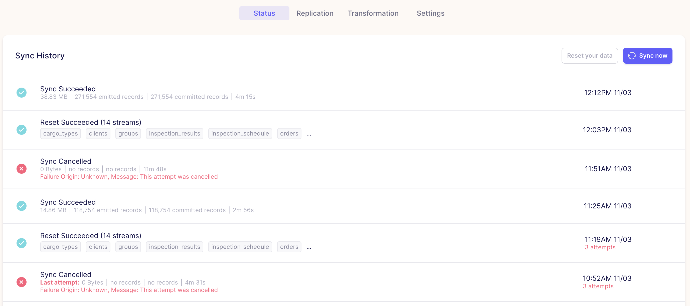

# Airbyte

## Что это такое

Писать сам не буду, умные люди уже [написали](https://habr.com/ru/company/otus/blog/574704/).

> [Airbyte](https://airbyte.com/) – это проект с открытым исходным кодом, который стремительно набирает популярность. Проект доступен на [​​GitHub](https://github.com/airbytehq/airbyte) (3.800+ stars), а сообщество в Slack насчитывает 2.500+ человек. По сути это современный стандарт для выстраивания потоков интеграции данных из всевозможных приложений, баз данных и API в аналитические хранилища данных, озера данных. Ниже я коротко рассмотрю ключевые преимущества инструмента.

> Обширный набор коннекторов, доступных для подключения в считанные минуты. В списке все самые популярные СУБД, а также огромное количество популярных сегодня приложений.

Кратко - Инструмент который берёт всю работу с переноса данных из одного места в другое на себя.

# Что нужно чтобы запустить

- [Docker](https://www.docker.com/);
- Умение набрать команду `docker compose up` на клавиатуре;
- (Возможно) Умение гуглить чтобы установить докер.

Сразу скажу, что в частности на Windows с докером возникает огромная куча проблем из-за того что под капотом он использует виртуализацию для запуска контейнеров. Если это - ваша первая встреча с докером, то советую найти какое-нибудь видео на ютубе или статью, вроде [этой](https://efsol.ru/manuals/docker-win-10.html).

Не пугайтесь если в процессе установки вас попросят залезть в параметры винды и включать какие-то там WSL и прочее, это всё нужно для включения виртуализации, которая изначально много где выключена. (В БИОС, кстати, тоже могут попросить залезть).

## Проверим установку

Если докер установлен и запущен, то попопробуем удостовериться в том, что он работает:

```bash
docker compose version
```

Должно получиться что-то такое:


Если всё ок - то всё хорошо, если нет, попробуйте через:

```bash
docker-compose version
```

Это старая версия данной команды, когда compose был отдельным пакетом.

Если ничего не заработало можно начинать ~~плакать~~ гуглить.

# Запуск

Если вы:

- А. Молодец (имеете установленный гит и используете консольку которая понимает линукс комманды в винде);
- Б. На линуксе или маке.

То данная магия сработает без проблем:

```bash
git clone https://github.com/airbytehq/airbyte.git
cd airbyte
docker-compose up
```

Если нет:

1. Заходим [сюда](https://github.com/airbytehq/airbyte);
2. Вверху справа нажимаем Code > Download ZIP;
3. Куда-нибудь распаковываем;
4. Открываем консоль в этой папке;
5. `docker compose up`.

Если всё сделано правильно, то появится следующая магия (гифка получилось длиннее, чем планировалось):


Docker начал скачивать необходимые файлы. В зависимости от интернета и типа жесткого диска, занять может до 10 минут +-.

Спустя какое-то время, сам Airbyte должен запуститься:


На этом этапе можем забыть про консоль (можно закрыть, но лучше просто свернуть).

# Airbyte

Переходим на [localhost:8000](http://localhost:8000/).

Стандартный логин и пароль: `airbyte`.

Очень кратко и по порядку о том, что тут есть:

## Sources

Это наши источники данных

Как добавить источник я думаю разберётесь сами. Для примера оставлю скрин конфигурации для Postgres:


Обратите внимание на то, что `Schema` пустая.

## Destinations

Это то, куда данные будут загружаться. Пример конфига (тут уже схема есть):


## Connections

Соединения между Источниками(Sources) и Направлениями(Destinations).

При создании соединений вас попросят выбрать уже существующие соединения либо предложат создать новые. Выбираем из существующих и ждём пока всё завершиться.

**Важно:** Изначально, Airbyte позиционирует себя как EL(T) инструмент - т.е. он умеет выгружать и загружать данные в различные источники в их исходном формате. Что добавить Transform необходимо написать свой dbt модуль, который он будет подгружать при каждой сихронизации (читай - копировании) данных. Об этом будет позже.

Пока что давайте разберёмся как нам сделать копию одной базы в другой (Extract - Load).

### В соединениях есть 4 подменю, начнём от скучного к самому интересному:

#### Settings - Настройки

Тут ничего интересного, но можно удалить соединение, если оно не нужно.

_почему у удаления отступ слева больше?_


#### Status - Статус



Здесь мы можем запускать процесс синхронизации вручную (Sync Now, кнопка справа), а так же видеть логи уже выполненных (или проваленных) синхронизаций.

Вот, например, лог последней удачной синхронизации. _Если вы уже пролистали README по `dbt`, то вы заметите что финальные строки их совпадают, указывая на то, что он подтянул наш проект с гита и выполнил необходимые преобразования._


#### Replication - Репликация


В репликации мы можем выбрать частоту синхронизации.

- Manual - Ручная;
- Cron - с использованием cron синтаксиса. Если не знаете что это, лучше не выбирать;
- По часам.

(Для локального пользования советую выбрать Manual.)

Опции с потоками (Streams) советую не трогать, но кратко опишу что они делают:

- Destination Namespace - определяет вид клонирования данных;
  - Mirror source structure - полное клонирование исходной БД;
- Destination Stream Prefix - Префикс **после** клонирования, в финальной базе.

Далее можно выбрать какие таблицы мы хотим синхронизировать и тип синхронизации:


Про типы синхронизации (Sync Mode) подробно [тут (англ)](https://airbytehq.github.io/understanding-airbyte/connections/#sync-modes). Ниже краткое описание, по ссылке есть таблички с наглядными примерами как работает каждый режим.

1. [Full Refresh Overwrite](https://airbytehq.github.io/understanding-airbyte/connections/full-refresh-overwrite/): Полностью вычищает таблицы перед добавлением данных;
2. [Full Refresh Append](https://airbytehq.github.io/understanding-airbyte/connections/full-refresh-append/): Добавляет ВСЕ данные из исходной таблицы к уже имеющимся данным;
3. [Incremental Append](https://airbytehq.github.io/understanding-airbyte/connections/incremental-append/): Добавляет в выходную таблицу только **новые** (изменённые) данные;
4. [Incremental Deduped History](https://airbytehq.github.io/understanding-airbyte/connections/incremental-deduped-history/): Работает как предыдущий режим за тем исключением, что удаляет повторяющиеся данные.

Если не знаете какой выбирать - берите Full Refresh Overwrite (#1).

#### Transformation - Трансформация

Последнее и самое интересное - Трансформация данных;


Изначально выглядит вполне безобидно.

Верхняя менюшка позволяет выбрать _базовый_ вид преобразований (нормализации) - табличный либо голый JSON.

Нормализацию в виде таблиц поддерживают не все выходные источники (т.к. Airbyte работает не только с базами, но и с REST-API, файлами и многим другим), но у вас должна эта опция быть. Если интересно как точно работает - [тут (англ)](https://docs.airbyte.com/understanding-airbyte/basic-normalization/).

Если мы хотим добавить свою, самостоятельную нормализацию \ трансформацию, то нужно указать в _Custom Transformations_ своё вариант.

---

## На этом моменте я предполагаю что вы ознакомились со следующими вещами:

1. _(Не обязательно)_ Статья из 3 частей от Airbyte о том, как работать с dbt в Airbyte (Она на английском, но с переводчиком и примерами можно понять что там происходит). Во 2 и 3 частях рассказано как вытягивать пример dbt проекта, который Airbyte генерирует сам для базовой нормализации (та, которая по умолчанию):
   1. [Часть 1](https://airbytehq.github.io/operator-guides/transformation-and-normalization/transformations-with-sql)
   1. [Часть 2](https://airbytehq.github.io/operator-guides/transformation-and-normalization/transformations-with-dbt/)
   1. [Часть 3](https://airbytehq.github.io/operator-guides/transformation-and-normalization/transformations-with-airbyte/)
2. [README.md](./README.md) о том что такое dbt и как с этим существовать...

---

Итак, у вас есть локальный dbt проект, который работает и делает, то что вам нужно. Теперь нужно запихать его в Airbyte чтобы это делалось автоматом. Создадим новую трансформацию. _(Данная трансформация будет выполнять ПОСЛЕ и ПОВЕРХ базовой трансформации, поэтому даже вы смело можете подразумевать, что все таблички у вас скопированы и готовы.)_


- Transformation name - Имя, технической роли не играет;
- Docker image URL with dbt installed - Докер контейнер, в который будет загружаться гит перед исполнением. Тот, что по умолчанию нам не подходим, как минимум потому что он не умеет подтягивать зависимости (`dbt deps`), поэтому используем тот, что от Airbyte. Последний можно взять [отсюда](https://hub.docker.com/r/airbyte/normalization/tags);
  - Даже если берёте тот что самый новый, советую брать tag с версией, вместо latest. (как на картинке);
- Git repository URL of the custom transformation project - **Публичный** гит-репозиторий. (Если совсем времени не жалко, можно и приватный использовать, как именно - показано [тут](https://airbytehq.github.io/operator-guides/transformation-and-normalization/transformations-with-airbyte/#private-git-repository));
- Transformation type - тип трансформации, хз зачем если выбор только один;
- Entrypoint arguments for dbt cli to run the project - Как запускать dbt. Помните мы делали переменные вместо логина и пароля? Вот тут теперь мы можем их указать и они у нас будут локально только в этой системе, а не где-то на гите для всеобщего обозрения;
- Git branch name - имя гит ветки. Если main/master - оставляйте пустым.

Для ленивых:

```
run --vars '{"DBT_USER":"test","DBT_PASS":"test"}' --profiles-dir=.
```

### Проверяем

**НЕ ЗАБУДЬТЕ РАСКОММЕНТИРОВАТЬ `packages-install-path` В `dbt_project.yml`.**

Теперь можем попытаться запустить синхронизацию:


На моей машине весь процесс занимает от 10 минут, поэтому смело можно уходить за кофейком ☕

Где-то в середине процесса можно увидеть следующее:


Если у вас где-то есть ошибки, то ловить их нужно тут. В этом моменте он запускает указанный нами контейнер, клонирует туда наш гит-репозиторий и пытается его запустить.

Из того что может вылезти:

- Неправильно настроен конфиг (в том числе и sources в dbt);
- Не установились зависимости;
- Не тот гит;
- Кривое имя контейнера.

Если всё хорошо, то вы должны наблюдать что-то подобное:


Проверим базу:


Поздравляю с потраченным временем!
