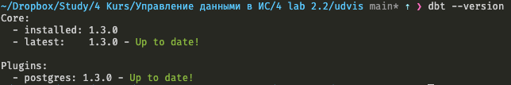
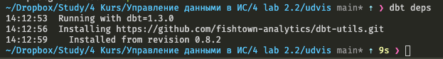
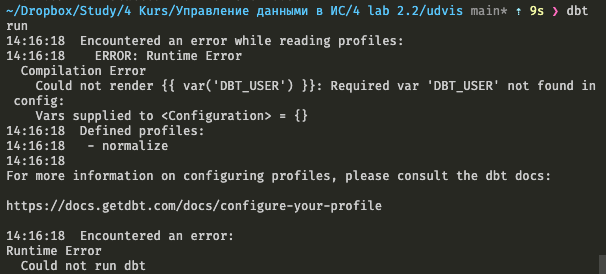
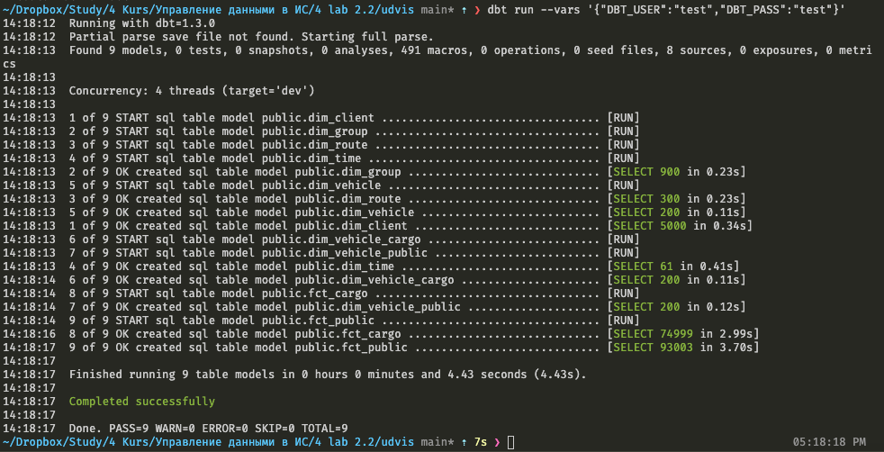

# УДвИС

Данный проект использует возможности [Data build tool](https://docs.getdbt.com/) (далее dbt) чтобы выполнить трансформацию данных в процессе ELT (не ETL).

_Сразу скажу, что из-за особенностей dbt, возможно работа только внутри одной базы данных. Вытягивать информацию даже из соседней базы (даже внутри одного сервера) оно не умеет. Ну или по крайней мере у меня не получилось_

По большей части это краткий пересказ [официального гайда](https://docs.getdbt.com/docs/get-started/getting-started/overview) (который на английском). Если кто-то планирует идти по нему - нам нужен `dbt Core`

## Подготовка

Использование сие туториала подразумевает, что у вас успешно установлен и запущен Airbyte и выполнен хотя бы один Sync. _(можно конечно и прямо в исходной базе это прогонять, но тогда из ETL (ELT в нашем случае) у нас теряется E и L)_

О том как сделать `docker compose up` и запустить Airbyte для самых маленьких - [тута](./HOWTO_Airbyte.md)

## Установка

> Если мак, то есть [`brew`](https://docs.getdbt.com/docs/get-started/installation).

> Если не мак, то советую через [Питоновский `pip`](https://docs.getdbt.com/docs/get-started/pip-install), как самый безболезненный вариант. (Если умеете, лучше через venv или что-то подобное)

Не забудьте поставить драйвер под свою базу. В примере используется BigQuery от Google, вам, вероятнее всего, нужна PostgreSQL.

_Есть ещё вариант через докер, но имхо это очень неудобно, ибо надо подгружать проект в докер_

## Проверяем

Сверимся что всё ок

```bash
dbt --version
```

Должно быть что-то такое.


Если нет - перепроверяйте установку

## Структура

В `/models/marts/...` лежат модели. **Название файла = имя финальной таблицы**

- `dim_*.sql` - измерения
- `fct_*.sql` - факты

В этих файлах вполне обычный SQL синтаксис с парочкой новшевст, но если вы знакомы с шаблонизатором Jinja2 для питона, то для вас всё стандартно. Обычно он применяется вебе. На этом особо оставливаться не будем, как что использовать должно быть понятно из примеров.

`/models/schema.yml` - больше о том что и как - [тут](https://docs.getdbt.com/docs/build/sources)

**Важно:**

- Имя, указанное в схеме как имя источника будет потом использоваться как первый аргумент в source() (о котором позже)
- Только те таблицы, которые вы указали там, будут подгружены для выборки из них через source(). Если таблицы нет - dbt будет ругаться на отсутствующую таблицу.

`.user.yml` - будет создан после первого запуска, не трогаем.

`dbt_project.yml` - полная спецификация [тут](https://docs.getdbt.com/reference/dbt_project.yml), нас интересует только `packages-install-path: /dbt` и `profile: "normalize"`. К обоим вернёмся, просто ментально поставим галочку на этих строчках.

`packages.yml` - [Зависимости](https://docs.getdbt.com/docs/build/packages), лучше не трогать.

`profiles.yml` - профили подключения. Их может быть несколько, более подробно [тут](https://docs.getdbt.com/reference/profiles.yml)

**Важно:**

- Советую логин и пароль оставить переменными, т.к. тащить секреты в публичные источники (гит) - не есть ок.
- Выходных источников может быть несколько, тот что будет выполняться - указывается в `target: dev`
- Первая строка (`normalize`) должна совпадать с именем профиля в `dbt_project.yml`. Иначе dbt будет жаловаться что не может найти профиль. Если планируете использовать с Airbyte - нужно оставить **normalize**
- Если не Postgres, не забудьте сменить тип.

## Синтаксис

Больше о доступных Jinja функциях [здесь](https://docs.getdbt.com/reference/dbt-jinja-functions) (если нужно), нас интересуют только 3:

### source(str, str)

Пример:

```python
{{ source ("public", "groups") }}
```

Выбирает из схемы, имя которой мы указали в `schemas.yml` табличку. Табличка схема должны существовать

### ref(str)

Пример:

```python
{{ ref ("dim_vehicle") }}
```

Позволяет получить табличку, которую мы используем в процессе трансформации. Советую использовать эту функцию, а не просто писать имя таблички ибо это помогает dbt строить зависимости того, что в какой последовательности загружать.

### surrogate_key(list[str])

Пример:

```python
{{ dbt_utils.surrogate_key (["id", "weight_cap"]) }}
```

Создаёт суррогатный (читай - первичный) ключ на основе полей. В функцию обязательно должен передаваться массив, даже из одного поля.

### Не особо интересует, но всё же - var(str)

Пример:

```python
{{ var('DBT_USER') }}
```

Получает значение переданной переменной при запуске.

## Запуск локально

Если вы планируете отлаживать локально, то в `dbt_project.yml` нужно закомментировать строку с `packages-install-path`, так как она указывает куда устанавливать зависимости. Для Airbyte это должно быть обязательно `/dbt`, а локально - нам это не важно. По умолчанию это `./dbt_packages`

Для начала загрузим зависимости

```bash
$ dbt deps
```

dbt Создаст `.user.yml`, где будет лежать ваш уникальный ID для отслеживая статистики. Оно вам в целом не надо, на git грузить его тоже не нужно.

Результат должен быть примерно таким



После того как всё установили и если всё настроено правильно - можем запускать программу с помощью

```bash
$ dbt run
```

На что сразу получим ошибку


Ругается он на то, что мы указали что будем использовать переменные при подключении, но не передали их ему. Попробуем ещё раз...

```bash
dbt run --vars '{"DBT_USER":"test","DBT_PASS":"test"}'
```

Если всё ок, то вы должны увидеть следующие строчки счастья


**Не забудьте перед использованием в Airbyte раскомментировать строку хранения зависимостей в `dbt_project.yml`!**
